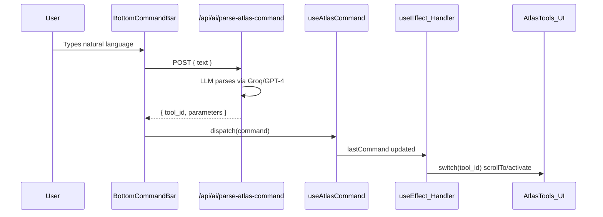

# Atlas Command Bar Audit and Upgrade Plan

## Current Architecture




There is also a **separate** Strategy Lab NLP input at the top of the Lab tab that uses a different, regex-based parser (`/api/ai/parse`). These two systems are **disconnected**.

---

## What Works Today

The bottom bar sends user text to an LLM which maps it to one of 12 tool IDs defined in `[src/lib/atlas-tool-manifest.ts](src/lib/atlas-tool-manifest.ts)`. The handler in `[src/components/atlas/atlas-client.tsx](src/components/atlas/atlas-client.tsx)` (lines ~222-328) then executes the matching action. Working commands:

- **"go to the lab"** / **"show quests"** -- tab navigation
- **"scan airdrops"** -- switches to Quests, triggers airdrop scan, scrolls to card
- **"swap tokens"** -- switches to Quests, scrolls to Jupiter card (but hardcodes SOL->USDC)
- **"stake 5 SOL"** -- switches to Lab, sets amount, simulates
- **"provide liquidity"** -- switches to Lab, sets LP mode, simulates
- **"show holder insights for [mint]"** -- sets mint, fetches, scrolls
- **"scan MEV"** -- scrolls to MEV scanner
- **"create a DCA bot"** -- opens DCA modal
- **"open time machine"** -- scrolls to Transaction Time Machine
- **"copy wallet"** -- scrolls to Copy My Wallet

---

## Issues Found

### 1. Manifest / Handler Mismatches


| Manifest tool_id           | Handler case        | Status                                                                     |
| -------------------------- | ------------------- | -------------------------------------------------------------------------- |
| `rug_pull_detector`        | --                  | NOT HANDLED (dead tool)                                                    |
| `portfolio_rebalancer`     | --                  | NOT HANDLED (dead tool)                                                    |
| `fee_saver_insights`       | --                  | NOT HANDLED (dead tool)                                                    |
| `transaction_time_machine` | `open_time_machine` | NAME MISMATCH -- LLM returns manifest ID, handler expects different string |
| `copy_trader`              | `copy_my_wallet`    | NAME MISMATCH -- same issue                                                |
| --                         | `provide_liquidity` | NOT IN MANIFEST -- LLM can never emit this tool_id                         |


### 2. Hardcoded Swap Parameters

In the `swap_tokens` handler (line ~271), input/output mints are hardcoded:

```
inputMint: MINTS.SOL,
outputMint: "EPjFWdd5AufqSSqeM2qN1xzybapC8G4wEGGkZwyTDt1v" // always USDC
```

The LLM extracts `input_mint` and `output_mint` parameters but they're **never used**. Saying "swap 10 USDC to JUP" still does SOL->USDC.

### 3. Two Disconnected NLP Systems

- **Bottom bar**: LLM-powered, routes to tools, but can't set Strategy Lab params (token pair, LST selection)
- **Strategy Lab input**: Regex-powered, sets strategy kind + amount + simulates, but only works from the Lab tab

The bottom bar should be the **single entry point** that can do everything the Lab input can do.

### 4. No Strategy Lab Deep Commands

The bottom bar can say "stake 5 SOL" to open the Lab, but cannot:

- Select a specific LST: "stake 5 SOL with Jito"
- Set a swap pair: "swap 10 SOL to JUP" (always does SOL->USDC)
- Auto-execute: "execute swap 5 SOL to USDC" (only simulates, never triggers execute)
- Compare strategies: "compare stake vs LP for 10 SOL"

### 5. No Conversational Feedback

After a command is processed, the user only sees a toast and a scroll. There's no response like "Got it -- staking 5 SOL via Marinade at 8.82% APY. Connect wallet to execute."

### 6. Missing Tool Categories

Commands that should work but don't:

- **Price queries**: "what's the price of SOL?" / "show me SOL price"
- **Portfolio overview**: "show my balance" / "what do I have?"
- **Token search**: "find BONK" / "look up JTO"
- **Market pulse**: "how's the market?" / "show market overview"
- **Risk check**: "is this token safe? [mint]"

---

## Proposed Fixes

### Phase 1: Fix What's Broken (critical)

- **Sync manifest with handler** -- rename handler cases to match manifest IDs (`open_time_machine` -> `transaction_time_machine`, `copy_my_wallet` -> `copy_trader`), add missing handlers for `rug_pull_detector`, `portfolio_rebalancer`, `fee_saver_insights`
- **Add `provide_liquidity` to manifest** so LLM can emit it
- **Use actual LLM-extracted parameters in swap_tokens** -- map token names to mints instead of hardcoding SOL->USDC
- **Pass LST selection through stake_sol** -- if parameters include `provider: "jito"`, set `selectedLst` accordingly

### Phase 2: Unify the Two NLP Systems (high value)

- **Route Strategy Lab commands through the bottom bar handler** -- when `stake_sol`, `swap_tokens`, or `provide_liquidity` is dispatched, use the same logic as `handleParse` (set kind, amount, simulate)
- **Enrich the manifest** with LST/token parameters so the LLM can extract "stake 5 SOL with Jito" -> `{ tool_id: "stake_sol", parameters: { amount: 5, provider: "jito" } }`
- **Add a local regex fallback** in the bottom bar handler (like the Lab input has) so commands work even when the LLM API is down

### Phase 3: Add Missing Commands (nice to have)

- Add `price_check` tool to manifest for "what's the price of SOL?"
- Add `show_portfolio` tool for "show my balance"
- Add `market_overview` tool for "how's the market?"
- Return a conversational response from the LLM alongside the tool_id for richer feedback toasts

