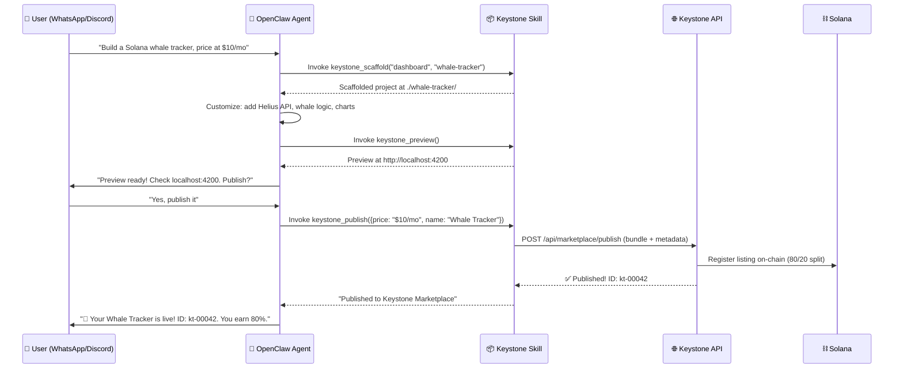

# OpenClaw × Keystone: Skill Integration Research

## Executive Summary

This document outlines a strategy for publishing **Keystone Treasury OS as an OpenClaw Skill**, enabling users to instruct their local AI agent to **build mini-apps** (treasury dashboards, DeFi tools, analytics widgets) and **publish them directly to a Keystone Marketplace** — earning **80% revenue** on every sale.

---

## 1. How OpenClaw Skills Work

### Architecture Recap

OpenClaw distinguishes **Tools** (foundational system capabilities) from **Skills** (instructions that teach the AI how to combine tools). A skill is essentially a "textbook" for the agent.

| Component | Purpose |
|---|---|
| `SKILL.md` | YAML frontmatter + markdown instructions — the core of any skill |
| `scripts/` | Helper scripts (TypeScript, shell) the agent can invoke |
| `examples/` | Reference implementations and templates |
| `openclaw.plugin.json` | Manifest for full TypeScript plugins (advanced) |

### Skill Types

| Type | Best For |
|---|---|
| **Natural Language** (`SKILL.md` only) | Simple runbooks, instructions for common tasks |
| **TypeScript Plugin** | Complex logic, API calls, deep integration |
| **CLI-Based** | Wrapping existing CLI tools (like a Keystone CLI) |

### Publishing & Distribution

- **ClawHub** = OpenClaw's public skill marketplace
- Install via `clawhub` CLI, GitHub URL, or manual copy to `~/.openclaw/workspace/skills/`
- Skills can be **free** or **premium** ($10–$50 per skill, $50–$200 bundles)

---

## 2. Keystone as an OpenClaw Skill — The Vision

### What the User Experience Looks Like

```
User → OpenClaw (WhatsApp/Discord/Telegram):
  "Build me a Solana whale tracker dashboard that shows top 50
   wallets by SOL holdings and their recent DeFi activity.
   Publish it to the Keystone Marketplace for $15/month."

OpenClaw Agent → Executes:
  1. Uses Keystone Skill to scaffold a mini-app from templates
  2. Integrates Helius API for wallet data
  3. Adds Bitquery for analytics
  4. Generates React components using Keystone SDK patterns
  5. Auto-tests locally
  6. Publishes to Keystone Marketplace via API
  7. Confirms listing + revenue split (80% to creator)
```

### The 80/20 Revenue Model

| Party | Revenue Share | Role |
|---|---|---|
| **Creator** (OpenClaw user) | **80%** | Builds the mini-app via natural language |
| **Keystone Platform** | **20%** | Hosting, marketplace listing, payment processing, Solana infra |

Revenue is distributed via **Solana smart contracts** (SPL token / USDC), ensuring trustless, transparent payouts.

---

## 3. Skill Architecture — `keystone-treasury` Skill

### Directory Structure

```
~/.openclaw/workspace/skills/keystone-treasury/
├── SKILL.md                    # Main skill instructions
├── scripts/
│   ├── scaffold-mini-app.ts    # Generate app from template
│   ├── publish-to-marketplace.ts # API call to publish
│   ├── preview-app.ts          # Local preview server
│   └── check-revenue.ts       # Query earnings from chain
├── templates/
│   ├── dashboard/              # Dashboard mini-app template
│   ├── analytics-widget/       # Widget template
│   ├── defi-tool/             # DeFi tool template
│   └── portfolio-tracker/      # Portfolio tracker template
├── examples/
│   ├── whale-tracker.md        # Example: build a whale tracker
│   ├── airdrop-scanner.md      # Example: build an airdrop scanner
│   └── yield-optimizer.md      # Example: build a yield optimizer
└── openclaw.plugin.json        # Plugin manifest (for tool registration)
```

### SKILL.md — Core Instructions

```yaml
---
name: keystone-treasury
description: >
  Build, preview, and publish Web3 treasury mini-apps to the Keystone
  Marketplace. Earn 80% revenue on every sale. Supports dashboards,
  analytics widgets, DeFi tools, and portfolio trackers powered by
  Solana, Helius, Bitquery, and Jupiter integrations.
version: 1.0.0
author: keystone-os
tags:
  - web3
  - solana
  - treasury
  - defi
  - marketplace
---
```

The markdown body would contain detailed instructions for the agent on:

1. **How to scaffold** — Which template to use based on user intent
2. **How to customize** — Integrating APIs (Helius, Bitquery, Jupiter, Marinade)
3. **How to preview** — Spinning up a local dev server for verification
4. **How to publish** — Calling the Keystone Marketplace API
5. **How to check earnings** — Querying on-chain revenue data

### Agent Tools (JSON-Schema Registration)

The plugin would register these tools for the LLM:

| Tool Name | Description |
|---|---|
| `keystone_scaffold` | Create a new mini-app from a template category |
| `keystone_add_datasource` | Wire up a data source (Helius, Bitquery, Jupiter, custom RPC) |
| `keystone_preview` | Start local preview and return URL |
| `keystone_publish` | Publish to Keystone Marketplace with pricing |
| `keystone_check_revenue` | Check creator earnings on-chain |
| `keystone_list_templates` | List available mini-app templates |
| `keystone_update_app` | Push an update to the already-published app |

---

## 4. What Keystone Needs to Build

### A. Marketplace API (Backend)

New API routes in the Keystone Next.js app:

| Endpoint | Method | Purpose |
|---|---|---|
| `/api/marketplace/publish` | POST | Accept a mini-app bundle + metadata, deploy it |
| `/api/marketplace/list` | GET | Browse available mini-apps |
| `/api/marketplace/app/:id` | GET | Get app details, pricing, revenue stats |
| `/api/marketplace/purchase` | POST | Handle purchase via Solana Pay / USDC |
| `/api/marketplace/earnings` | GET | Creator earnings dashboard (on-chain query) |
| `/api/marketplace/update` | PUT | Update an existing listing |

### B. Mini-App Template System

Reusable templates in the Keystone SDK (`packages/sdk/`):

- **Dashboard Template** — Grid layout, chart components, wallet connection
- **Analytics Widget Template** — Single-metric display, historical chart, alerts
- **DeFi Tool Template** — Swap interface, yield calculator, position tracker
- **Portfolio Tracker Template** — Multi-wallet view, PnL calculation, asset breakdown

Each template includes:
- Pre-wired Solana wallet adapter
- Component library (charts, tables, cards) from existing Keystone UI
- API integration stubs (Helius, Bitquery, Jupiter)
- Responsive layout (mobile + desktop)

### C. Revenue Distribution Smart Contract (Solana)

A Solana program (Anchor) under `programs/` that:

1. Escrows purchase payments (USDC or SOL)
2. Splits 80/20 on each sale
3. Allows creators to claim earnings
4. Emits events for on-chain revenue tracking

```
programs/
└── keystone-marketplace/
    ├── src/
    │   └── lib.rs          # Anchor program
    ├── Cargo.toml
    └── tests/
```

### D. OpenClaw Skill Package (Publishable to ClawHub)

The packaged skill that OpenClaw users install:
- Published to ClawHub as `keystone-treasury`
- Also installable via GitHub: `github.com/keystone-os/openclaw-skill`

---

## 5. Integration Flow — End to End



---

## 6. Competitive Advantages

| Advantage | Description |
|---|---|
| **Conversational App Building** | Users don't need to code — just describe what they want |
| **Instant Monetization** | 80% revenue from day one, paid in USDC/SOL |
| **Solana-Native** | Trustless revenue splits via smart contracts |
| **Distribution via OpenClaw** | Tap into OpenClaw's growing user base (100K+ installs) |
| **Template-Driven Quality** | Pre-built templates ensure consistent quality |
| **Non-Custodial** | Earnings go directly to creator's Solana wallet |

---

## 7. Potential Mini-App Categories

| Category | Examples |
|---|---|
| 📊 **Dashboards** | Whale tracker, DAO treasury overview, token holder analytics |
| 🔍 **Scanners** | Airdrop scanner, MEV detector, liquidation alerter |
| 🔄 **DeFi Tools** | Yield optimizer, DCA bot interface, LP calculator |
| 💼 **Treasury** | Multi-sig dashboard, budget tracker, payroll scheduler |
| 📈 **Analytics** | On-chain metrics, wallet profiler, protocol comparator |
| 🎮 **Social** | Governance voting UI, contributor leaderboard, grant tracker |

---

## 8. Security Considerations

> [!CAUTION]
> OpenClaw skills inherit the full permissions of the agent, including file system and network access. Keystone must implement safeguards.

| Risk | Mitigation |
|---|---|
| Malicious code injection in generated apps | Sandbox generation with AST validation, CSP headers |
| Unauthorized marketplace publishing | Require wallet signature for every publish action |
| Revenue theft | On-chain escrow with SPL-level access controls |
| API abuse | Rate limiting, API key scoping, auth via SIWS |
| Supply chain attack via skill updates | Skill version pinning, integrity hashes on ClawHub |

---

## 9. Implementation Phases

### Phase 1 — Foundation (Weeks 1–3)
- [ ] Design Marketplace API schema
- [ ] Build mini-app template system in `packages/sdk/`
- [ ] Create the `SKILL.md` with scaffold/preview instructions
- [ ] Ship the Keystone Marketplace smart contract (Anchor)

### Phase 2 — Skill Development (Weeks 4–5)
- [ ] Build TypeScript agent tools (`keystone_scaffold`, `keystone_preview`, etc.)
- [ ] Write example prompts and reference apps
- [ ] Integrate with Keystone's existing Helius/Bitquery/Jupiter APIs
- [ ] Local testing with OpenClaw agent

### Phase 3 — Marketplace & Revenue (Weeks 6–7)
- [ ] Build marketplace UI pages in Keystone (browse, purchase, manage)
- [ ] Implement Solana Pay / USDC purchase flow
- [ ] Deploy revenue-split smart contract to devnet → mainnet
- [ ] Creator earnings dashboard

### Phase 4 — Launch (Week 8)
- [ ] Publish `keystone-treasury` skill to ClawHub
- [ ] Publish GitHub repo for manual installation
- [ ] Launch marketing: "Build Web3 tools with a chat message. Earn 80%."
- [ ] Community onboarding guides

---

## 10. Quick Wins — Start Here

If you want to begin immediately, the fastest path is:

1. **Create the `SKILL.md`** — A natural language skill that teaches OpenClaw how to use the Keystone CLI/SDK to scaffold apps. This requires zero TypeScript plugin work.
2. **Build 3 starter templates** — Dashboard, DeFi Tool, Analytics Widget. Drop them into `packages/sdk/templates/`.
3. **Add a `/api/marketplace/publish` endpoint** — Even a minimal version that accepts a bundle and stores metadata in Neon/Supabase.

This gets a working prototype into OpenClaw users' hands while you build out the smart contract and full marketplace.
